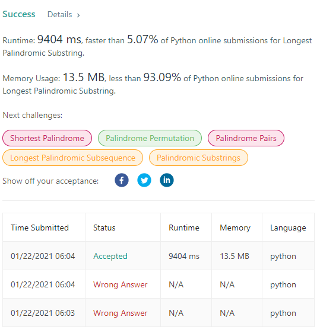

### 가장 긴 팰린드롬 부분 문자열

가장 긴 팰린드롬 부분 문자열을 출력하라.

```
입력
"babad+"
출력
"bab"
* "bab" 외에 "aba"도 정답이다.
```

---

문제를 보고, 가장 먼저 생각난 풀이는 다음과 같다.

찾을 substring의 길이를 1씩 줄여가며 브루트 포스로 각 문자열이 팰린드롬인지 체크한다.

```
def isPalindrome(input):
    if (input[::-1] == input):
        return True
    return False


def longestPalindrome(input):
    length = len(input)
    step = length
    answer = ""
    breakpoint = False

    while step > 2:
        for i in range(length-step+1):
            if(isPalindrome(input[i:i+step])):
                answer = input[i:i+step]
                breakpoint = True
                break
        if(breakpoint):
            break
        step -= 1

    return answer
```

결과



결과는 다음과 같이 썩 좋지 못한데, 최악의 경우 주어진 입력값의 거의 모든 substring을 검사해야 하는 위의 로직상 O(n^2)에 가까운 시간 복잡도를 띄고 있기 때문이다.

먼저, 개선된 방식은 2, 3길이의 팰린드롬이 부분 문자열로 존재하지 않는다면, 어떠한 부분 문자열도 팰린드롬이 될 수 없다는 아이디어에서 시작한다.

따라서, 2, 3길이의 부분 문자열에 대해서 해당 문자열이 팰린드롬이라면, 크기를 점점 넓혀가며 검사하는 방식으로 구현된다.

만약 bb와 같이 짝수인 팰린드롬이 검출되면 2->4->6 의 순서로 확장될 것이며, aba처럼 홀수인 경우라면 1->3->5이 된다.

---

1. 예외 처리(주어진 문장 자체가 팰린드롬인 경우)와 문장이 한단어인 경우 바로 return 하여 풀이 속도를 높일 수 있다

```python
if len(s) < 2 or s == s[::-1]:
    return s
```

2. 슬라이딩 윈도우를 문자열 처음부터 끝까지 이동시키며 가장 긴 값을 저장하고, 루프를 돌며 그 값과 길이를 비교하여 결과를 업데이트 해준다.

```python
result = ''
for i in range(0, len(s) - 1):
    result = max(result,
                 expand(i, i + 1),
                 expand(i, i + 2),
                 key=len)
return result
```

3. expand()함수는 홀수, 짝수 2개의 투 포인터가 팰린드롬 여부를 판별하며 확장되어 가장 긴 팰린드롬을 검출한다.

```python
def expand(left, right):
    while left >= 0 and right < len(s) and s[left] == s[right]:
        left -= 1
        right += 1
    return s[left + 1:right]
```
