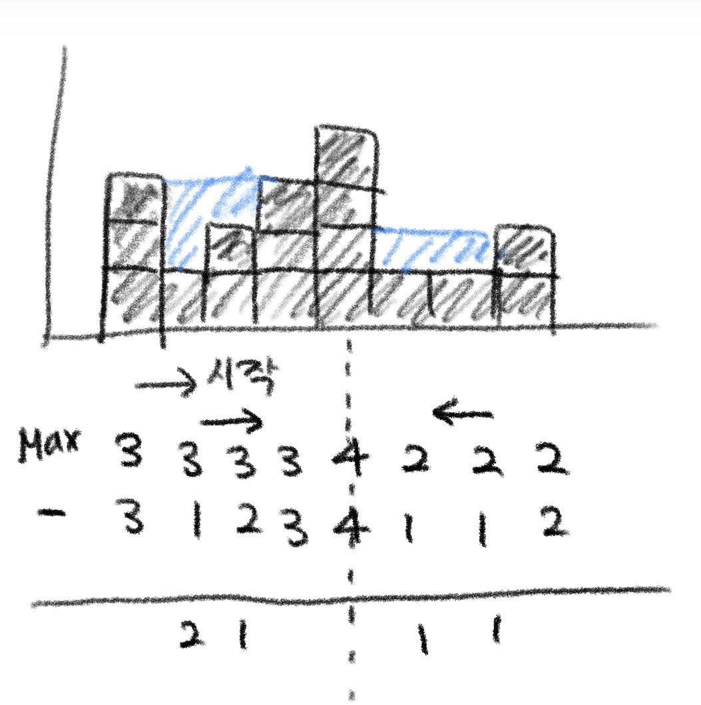

### 빗물 트래핑

높이를 입력받아 비가 온 후 얼마나 많은 물이 쌓일 수 있는지 계산하라.

```
입력
[3, 1, 2, 3, 4, 1, 1, 2]
출력
5
```

\*그림으로 표현하면 다음과 같다.


---

이 문제를 풀 수 있는 방법은 여러 가지가 있다.

### 1. 투 포인터를 최댓값으로 이동

```
code: rainTrap1.py
```



그림이 다소 알아보기 난해하지만, 기본적인 아이디어는 다음과 같다.

1. 받은 배열에서 가장 큰 값(가장 높은 블록)을 경계로 좌와 우로 나뉜다.
2. 각각 좌측과 우측으로 나뉘어 가장 큰 값으로 오면서 받을 수 있는 빗물을 구한다.

받을 수 있는 빗물을 구하는 것은 이동 과정 중의 max 값에서 현재 값을 뺀 결과로 구할 수 있다.

```python
def rainTrap(heights):
    if not heights:  # 예외 처리
        return 0

    volume = 0
    left, right = 0, len(heights) - 1
    left_max, right_max = heights[left], heights[right]

    while left < right:
        left_max, right_max = max(heights[left], left_max), max(
            heights[right], right_max)

        if left_max <= right_max:  # 투 포인터가 이동하는 조건을 설정한다.
            volume += left_max - heights[left]
            left += 1
        else:
            volume += right_max - heights[right]
            right -= 1

    return volume
```

처음의 예외처리를 해줘야 하며 중간 부분에서 투 포인터를 따로 움직이게 처리를 해준다.

### 2. 스택 쌓기

높이로 스택을 쌓으며 현재 높이가 이전보다 높을 때(변곡점을 만날 때), 스택의 값들을 하나씩 빼내며 물 높이를 채운다.

스택으로 이전 항목들을 되돌아보며 체크하지만, 같은 요소를 두번 처리하지 않기 때문에, O(n)으로 풀이할 수 있다.

```python
def rainTrap(heights):
    stack = []
    volume = 0

    for i in range(len(height)):
        # 변곡점을 만나는 경우
        while stack and height[i] > height[stack[-1]]:
            # 스택에서 빼냄
            top = stack.pop()

            if not len(stack):
                break

            # 이전과의 차이만큼 물 높이 처리
            distance = i - stack[-1] - 1
            waters = min(height[i], height[stack[-1]]) - height[top]

            volume += distance * waters

        stack.append(i)

    return volume
```
