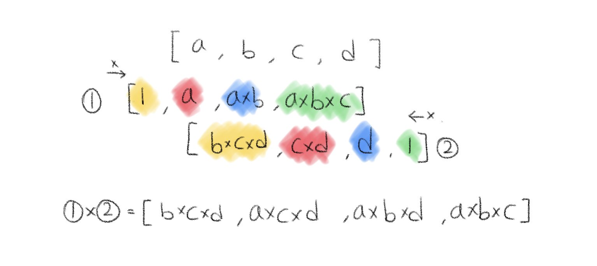
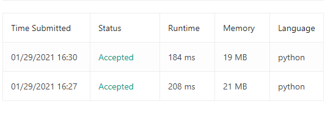

### 자신을 제외한 배열의 곱

[leetcode](https://leetcode.com/problems/product-of-array-except-self/)

배열을 입력받아 output[i]가 자신을 제외한 나머지 모든 요소의 곱셈 결과가 되도록 출력하라.

```
입력
[1, 2, 3, 4]
출력
[24, 12, 8, 6]

*주의
 나눗셈을 하지 않고 O(n)에 풀이하라
```

나눗셈을 하지 않고 이 문제를 풀기 위해서는 자기 자신을 제외하고 왼쪽의 곱셈 결과와 오른쪽의 곱셈 결과를 곱해야 한다.

해당 과정을 그림으로 보자면 다음과 같다.



처음엔 왼쪽에서 시작하여 1부터 시작한 배열에 해당 인덱스를 곱한 값을 넣으면 '자기자신을 제외한 왼쪽에서의 곱셈'의 결과가 된다.

같은 과정을 오른쪽에서 시작하여 반복하면 오른쪽에서의 곱셈의 결괏값이 나오고 최종적으로 두 배열을 곱해주면 된다.

```python
def productExceptSelf(self, nums):

    result = []
    p = 1

    for i in xrange(0, len(nums)):
        result.append(p)
        p = p * nums[i]

    p = 1
    for i in xrange(len(nums) - 1, 0 - 1, -1):
        result[i] = result[i] * p
        p = p * nums[i]

    return result
```

list의 장점을 살릴 필요 없이, 단순히 for 문에서 iteration을 돌릴 때에는 range 함수 대신, xrange를 활용하는 것이 효과적이다.



처음의 결과가 range 함수를 사용했을 때, 두번째가 xrange일 때의 결과인데 Runtime과 Memory의 사용이 둘다 줄어든 것을 볼 수 있다.

이는, range 객체는 list를 반환하여 이터레이션에 활용하지만 xrange는 generator를 반환하여 실행시마다 해당하는 값을 동적으로 생성하기 때문이라고 한다.

하지만, 검색해보니 파이썬 3.대의 버전에는 range가 없어지고, xrange로 통합되어 xrange를 사용하면 에러가 뜰 때도 있다고 한다.

코딩 테스트를 보는 환경에 따라 xrange를 활용 할 수 있다면 성능을 높이기 위해 시도해보는 것도 좋을 것 같다.
